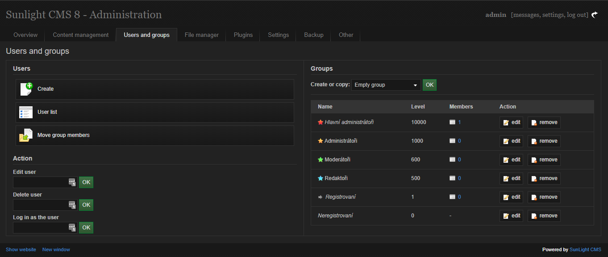

Admin Dark Theme Plugin
#######################

Custom dark theme for Sunlight CMS 8 administration

.. contents::

Preview
*******

Requirements
************

- SunLight CMS 8

Installation
************

#. Copy the folder ``plugin`` and its contents to the root directory or through system administration ``Administration > Plugins > Upload new plugins``

#. In the system settings, increase the cache number to force reloading of all system styles and scripts for all users
